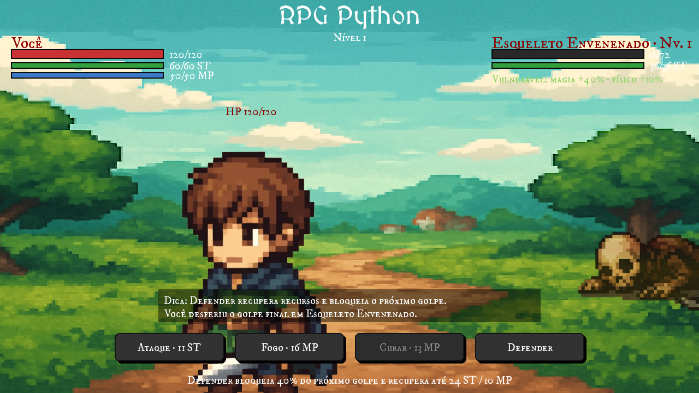
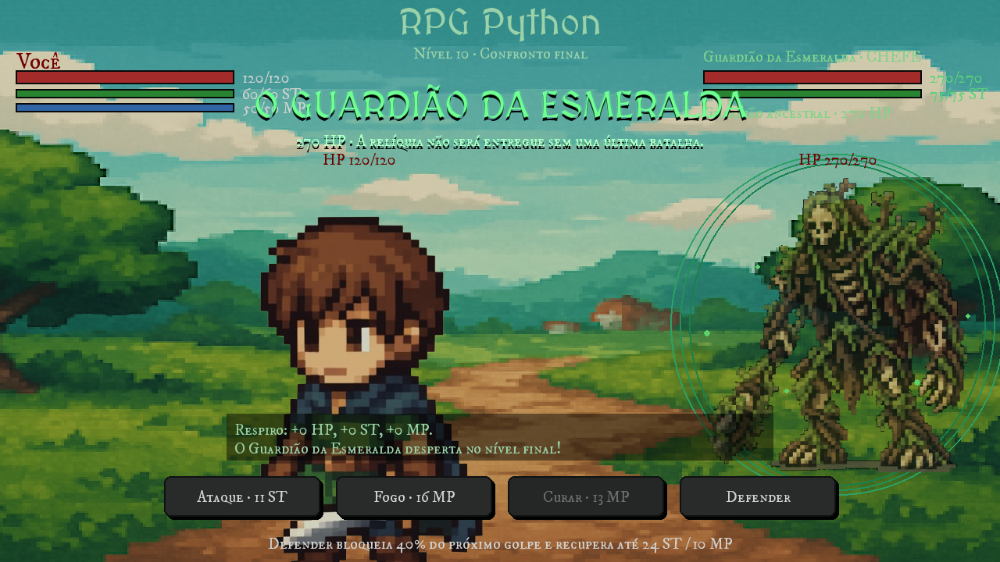
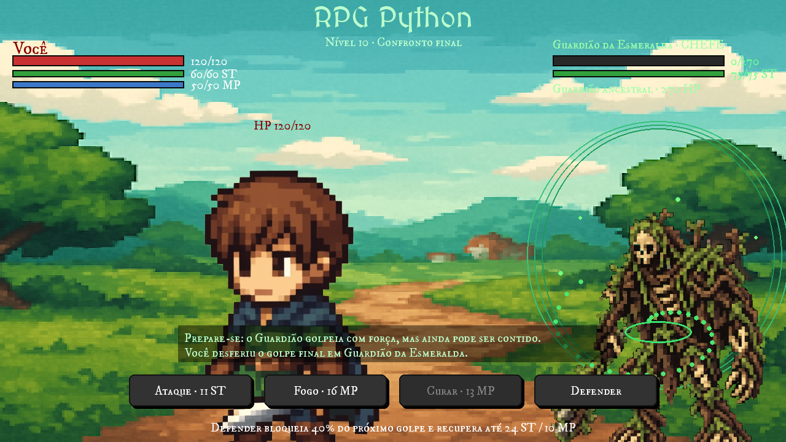
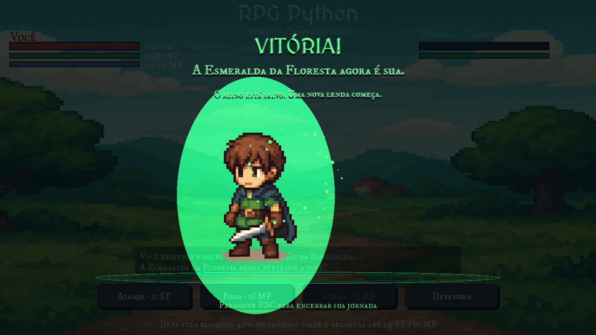

# ⚔️ A Esmeralda da Floresta — RPG de Turnos em Python


<p align="center">
  
</p>

Um RPG de turnos completo feito do zero com **Python e pygame**: avance por 10 níveis de combate contra esqueletos, enfrente o Guardião da Esmeralda e viva a cena final da aventura — com animações, efeitos visuais e interface responsiva, tudo em uma única janela redimensionável.

## 🎮 Como jogar

Cada ação válida consome seu turno e dá a vez ao inimigo. Gerenciar os três recursos — HP, stamina (ST) e mana (MP) — é o coração do combate:

| Ação | Custo | Efeito |
| :--- | :--- | :--- |
| ⚔️ **Ataque** | 11 ST | Causa 14–20 de dano físico |
| 🔥 **Bola de Fogo** | 16 MP | Causa 26–34 de dano mágico |
| 💚 **Curar** | 13 MP | Recupera 26–34 de HP |
| 🛡️ **Defender** | — | Reduz 40% do próximo golpe recebido e recupera até 24 ST e 10 MP |

O mouse controla tudo: basta clicar nos botões de ação na base da tela.

## 📈 Progressão

- Você começa com **120 HP, 60 ST e 50 MP** contra esqueletos que ficam mais fortes a cada nível (mais vida, stamina e dano).
- Há **25% de chance** de um esqueleto surgir **envenenado**: ele recebe **+40% de dano mágico** e **+10% de dano físico** — uma fraqueza que a interface destaca em verde. Bolas de Fogo são o caminho.
- Vencer um combate dá uma respirada: **+12 HP, +12 ST e +8 MP**.
- No **nível 10**, o **Guardião da Esmeralda** desperta com 270 HP em uma cutscene própria — e derrotá-lo desbloqueia a cena final da jornada.

## 🖼️ Screenshots

<p align="center">
  
  
</p>
<p align="center">
  
</p>

## 🚀 Executando

É preciso Python 3.10 ou mais recente.

**Windows (PowerShell):**

```powershell
python -m venv .venv
.venv\Scripts\Activate.ps1
pip install -r requirements.txt
python run.py
```

**Linux/macOS:**

```bash
python3 -m venv .venv
source .venv/bin/activate
pip install -r requirements.txt
python run.py
```

## 🧱 Estrutura do projeto

```
turno-python/
├── run.py                  # ponto de entrada
├── requirements.txt
├── assets/
│   ├── fonts/              # fontes do jogo
│   └── images/             # sprites, chefe e cenário
├── src/
│   ├── main.py             # game loop, máquina de estados e renderização
│   ├── personagem.py       # classe Personagem e regras de combate
│   ├── combat.py           # log de combate
│   ├── ui.py               # botões e texto
│   ├── assets.py           # carregamento de imagens (com fallback)
│   └── settings.py         # dimensões, cores e fontes
└── docs/img/               # screenshots
```

## 🛠️ Destaques técnicos

- **Máquina de estados no game loop** — turno do jogador, turno do inimigo, morte animada, introdução do chefe, vitória e game over fluem por um único loop explícito e legível.
- **Interface responsiva** — a janela é redimensionável e barras, botões e personagens reposicionam-se por proporção de tela.
- **Animações com easing** — tremor e flash de dano, colapso do chefe com partículas orbitais, aura pulsante e veneno com bolhas ascendentes usam interpolação (`pytweening`) em vez de movimento bruto.
- **Combate com tipos de dano** — dano físico e mágico atravessam multiplicadores por fraqueza, bloqueio e escalonamento por nível, com resultados arredondados de forma consistente.
- **Assets resilientes** — imagens ausentes viram placeholders sinalizados em vez de derrubar o jogo.

Feito com Python, pygame e cafeína. Divirta-se! 🌲💚
